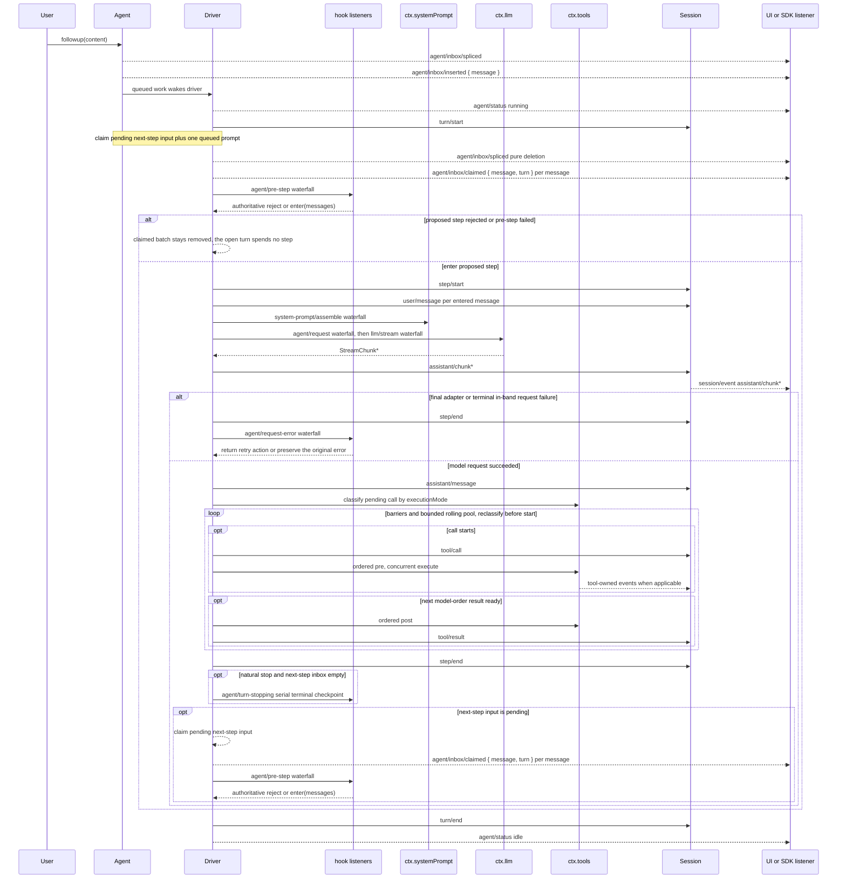

DeepSeek Harness agents are driven by a concrete loop (`core/agent-loop`) that implements the public `Agent` contract. A turn flows through six packages in one loop: the driver claims a queued prompt, opens a turn on the session log, assembles the request prefix through system-prompt assembly and derives history from the log, streams the model response through the LLM seam, dispatches tool calls through the tool registry, and appends every model-visible fact back onto the log before the next step derives from it.

## Turns and Steps

A **turn** is zero or more steps: it opens before its first input is claimed and closes once nothing is owed. A **step** is one model request plus the tool executions it requested.

A turn contains zero or more steps. A rejected `agent/pre-step` or an empty first claim still closes a durable turn that spent no step, so the log records the attempt even when no model request was made.

## The Turn Flow

The sequence below is the authoritative turn-flow description. Durable replay facts stay on `session/event`; live control and status travel on `agent/*`.



The `assistant/message` event records every successful provider call, including content-less and `max-tokens` finishes. Empty content stays out of derived history, while the durable event keeps usage and `sourceEventSeqs` listing the exact `assistant/chunk` events, including an explicit empty list.

## Waterfall Extension Points

`agent/pre-step`, `agent/request`, `llm/stream`, and the three `tools/*` events are **waterfalls**. A waterfall listener receives the current value along with a `next()` function:

- Calling `next()` delegates to the next listener in the chain, which returns the downstream decision.
- **Not** calling `next()` short-circuits the chain — the listener's own return value becomes authoritative.
- Wrapping `next()` (calling it, reading the result, and returning a modified value) lets a listener inspect and transform what downstream listeners produce without replacing the chain.

`agent/turn-stopping` is a **serial** event with **no `next()`**. All listeners are awaited in order; data decides the outcome, so listener order cannot change it. A listener that wants to keep the turn alive steers (`agent.steer(...)`) and the machine re-reads its inbox: fresh steering runs another step, none closes the turn.

| Event | Mode | What a listener can do |
|---|---|---|
| `agent/pre-step` | waterfall | Reject the proposed step or replace the message batch entering it |
| `agent/request` | waterfall | Replace the frozen call configuration (provider, model, sampling) |
| `llm/stream` | waterfall | Wrap or replace the streaming model response |
| `tools/pre-execute` | waterfall | Allow, deny, or ask approval for a pending tool call |
| `tools/execute` | waterfall | Wrap dispatch with timeouts, retries, or metrics |
| `tools/post-execute` | waterfall | Transform, block, or attach model-facing context to the result |
| `agent/turn-stopping` | serial | Steer the agent to continue, or let the turn close |

## Input and Inbox

Input reaches the driver through one inbox. The inbox owns two ordered pending-message lists:

- **`next-turn`** — ordinary follow-up messages; each becomes the sole message of its own turn.
- **`next-step`** — steering and injected context; claimed at the nearest step boundary.

Some messages wake the driver immediately (follow-up and steering); injected context (`agent.inject()`) waits in the inbox until another waking message does. `claim(target)` removes the proposed step batch — all `next-step` input plus, at a turn boundary, one `next-turn` message — through pure deletion splices.

```ts type-equiv
/** One of the two ordered pending-message lists owned by an agent. */
type InboxTarget = 'next-turn' | 'next-step'
```

## agent/pre-step

`agent/pre-step` is the only serial listener chain that runs **before** request derivation. It decides what the model sees for a given step.

The payload carries the exclusive claimed batch (`messages`), the proposed step's coordinates (`turn`, `step`), and the current turn's cancellation `signal`.

```ts type-equiv
/** Whether and with which messages the loop enters a proposed step. */
type PreStepDecision =
  | { kind: 'reject' }
  | { kind: 'enter'; messages: UserMessage[] }
```

- **Reject** opens no step. The claimed batch stays removed, the open turn spends no step, and the turn closes — the durable log records the attempt.
- **Enter** supplies the complete message batch appended after `step/start`. Claimed messages omitted by the final decision remain removed, while input inserted after the claim stays pending.

The returned decision is **authoritative**. Listeners wrapping `next()` preserve downstream messages unless replacement is intentional. Steering and injected context pass through the same waterfall after a later claim operation takes their next-step batch.

`dsh-compaction-basic` uses `agent/pre-step` for context pressure before request derivation and `agent/request-error` only for canonical context overflow. Once either trigger qualifies, optional tool-result pruning runs before summary selection. Recovery works between the closed failed step and failed turn close, and opens a fresh retry turn only when pruning or summarization advances the surface replacement generation.

## Cancellation and Error Recovery

`Agent.cancel(cause, options?)` clears queued and steering work — unless `keepInbox` is set — and aborts the active turn or between-turn task. The first cause wins for that activity. With no active activity, cancellation is a no-op and does not arm later work.

```ts type-equiv
/** Why an active agent driver was cancelled. */
type AgentCancelCause =
  | { readonly kind: 'user' }
  | { readonly kind: 'parent' }
  | { readonly kind: 'hook'; readonly reason: string }
  | { readonly kind: 'disposed' }
```

```ts type-equiv
/** Options for Agent.cancel. */
interface CancelOptions {
  /**
   * Preserve queued and steering inbox items instead of discarding them. The
   * active turn is still aborted, but un-started and pending work survives for a
   * later turn and no canceled inbox splice is logged.
   */
  keepInbox?: boolean | undefined
}
```

The cause is a TypeScript-enforced same-process input. An active cancellation holder copies it into the runtime-only `AbortSignal.reason`. Durable `turn/end` retains the coarse `{ kind: 'aborted' }` outcome; recording who requested cancellation would require a separate durable event rather than overloading the terminal result.

**Error recovery** — `agent/request-error` — runs after a failed model step closes and before its turn closes. Listeners can repair durable state or await policy work while the failed turn's signal is still live.

```ts type-equiv
/** Action returned by a listener that owns model-request recovery. */
type RequestErrorAction = { kind: 'retry' } | undefined
```

A handling listener returns `{ kind: 'retry' }` without calling `next()`; the default `undefined` leaves the failure terminal.

**Quiescence** — `Agent.whenIdle()` resolves after the current whole-agent activity reaches quiescence. It follows replacement work started before the observed driver retires, but does not identify the settlement of any particular message.

```ts type-equiv
/**
 * An agent's lifecycle state, emitted on every transition as `agent/status`.
 * `idle` means no driver is active; `running` begins when waking input starts
 * cancellable pre-step processing and lasts while the driver drains,
 * closes, or checkpoints turns.
 */
type AgentStatus = 'idle' | 'running'
```

`running` describes the driver-wide drain interval and may span consecutive queued turns; it does not prove a turn is still open. SDK users that need replayable transcript data should consume `session/event`; `agent/*` is the live coordination API for queue/status, prompt interception, request construction, steering, continuation, and errors.
