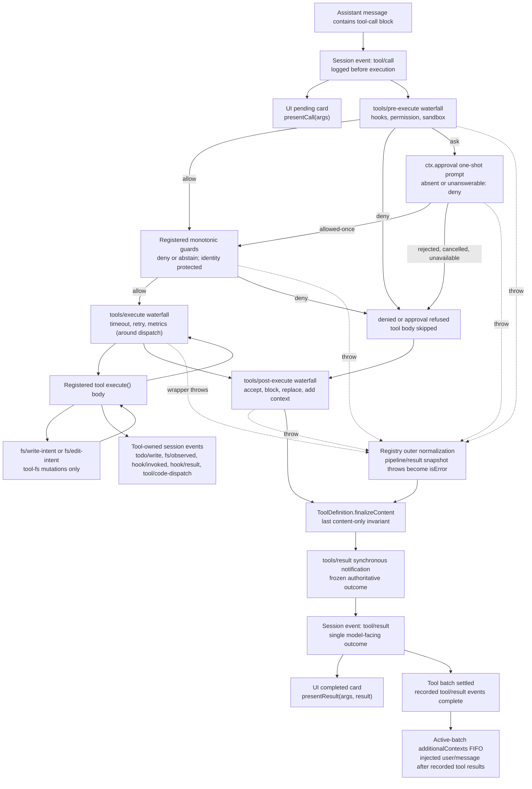

When a model response contains a tool-call block, that call passes through an ordered pipeline before its result is returned to the model. The pipeline separates concerns cleanly: policy runs first, execution wraps dispatch, transformation runs after, and observation closes the call. No stage needs to know about the others, and each stage hosts an extension point that hooks can target independently.



<Note>
**Which `tools/*` event to use:**
- `tools/pre-execute` — allow/deny/ask policy; runs before the tool body.
- `tools/execute` — lifecycle concerns around dispatch: timeouts, retries, metrics.
- `tools/post-execute` — result transformation: replace content, block the result, or attach model-facing context.
- `tools/result` — observation only; the outcome is immutable and frozen at this point.
</Note>

## Pipeline Stages

### 1. `tools/pre-execute` — Policy Waterfall

`tools/pre-execute` is a waterfall that runs before the tool body. Listeners decide the fate of the call:

- **allow** — passes to the registered monotonic guards.
- **deny** — skips the tool body; the call proceeds to `tools/post-execute` as a denied result.
- **ask** — forwards to `ctx.approval` for a one-shot human approval prompt. If the approval is unavailable, unanswerable, or rejected, the call is denied. If allowed-once, it proceeds to the monotonic guards.

Throws from a `tools/pre-execute` listener are caught by the registry's outer normalization boundary and become `isError` results before `finalizeContent` runs.

This is where hooks, permission policy, and sandbox checks attach. Listeners that must not be reordered (owner policy) register as monotonic guards instead.

### 2. `ctx.tools.guard()` — Monotonic Final Deny

Registered monotonic guards run after `tools/pre-execute`. A guard may deny or abstain; it cannot allow. Guards are **monotonic**: once registered they cannot be removed by a later `tools/pre-execute` listener. This makes them suitable for owner policy that must not be overridden.

A guard throw is also caught by the normalization boundary.

### 3. `tools/execute` — Dispatch Wrapper Waterfall

`tools/execute` wraps the dispatch lifetime. Listeners wrap the call to the tool body and can impose:

- **Timeouts** — abort `exec.signal` after a deadline.
- **Retries** — call `next()` again on failure.
- **Metrics** — record latency and outcomes around `await next()`.

The `exec.signal` field is the **operational abort signal**. An around-dispatch wrapper may replace and restore it to impose a deadline but cannot remove it. Only a wrapper in `tools/execute` receives a mutable view of `exec`; the tool body itself sees an immutable identity.

Wrapper throws are caught by the normalization boundary.

### 4. Execute Function Runs

The registered `execute()` body runs with typed, validated arguments and the immutable execution identity. Inside `execute()`:

- `args` is typed from the tool's `ParameterSchemaSpec` and validated before `execute` runs.
- `exec.signal` is the operational signal — honor it for cancellation.
- Tool-fs mutations fire `fs/write-intent` or `fs/edit-intent` waterfalls; filesystem read-before-edit checks stay below `tool-fs` on `fs/*` events.
- Tool-owned session events (`todo/write`, `fs/observed`, `hook/invoked`, `hook/result`, `tool/code-dispatch`) are appended during execution when applicable.

### 5. `tools/post-execute` — Result Transformation Waterfall

`tools/post-execute` runs after dispatch completes (or after a denied call skips the body). Listeners can:

- **Accept** the result as-is by calling `next()`.
- **Replace** the presentation content, leaving programmatic access to `value` intact.
- **Block** the result — for confidentiality policy.
- **Attach model-facing context** (`additionalContexts`) that is injected as `user/message` events after the batch's recorded tool results, in FIFO order.

A content replacement leaves the canonical `value` intact for programmatic consumers (e.g., Code Mode). Confidentiality policy blocks or replaces the value.

Throws are caught by the normalization boundary.

### 6. Registry Outer Normalization

The registry losslessly snapshots the candidate result and normalizes snapshot failures. A throw at any stage (pre-execute, execute wrapper, or post-execute) becomes an `isError` result rather than propagating as an uncaught exception. This normalization boundary runs before `finalizeContent`.

### 7. `ToolDefinition.finalizeContent` — Synchronous Content Invariant

`finalizeContent` is the last content-only invariant enforced by the tool definition itself. It is synchronous and may only transform content, not the canonical value. It runs on the snapshotted, normalized result.

### 8. `tools/result` — Immutable Outcome Observation

`tools/result` is a synchronous **emit** (not a waterfall) that fires after `finalizeContent`. The outcome is frozen and authoritative at this point — no further transformation is possible. Listeners observe the immutable normalized outcome.

After `tools/result`, the session event `tool/result` is appended, the UI completed card (`presentResult`) is called, and any `additionalContexts` are injected as `user/message` events.

## Execution Identity

The following fields are **immutable through the entire dispatch pipeline**:

| Field | What it is |
|---|---|
| `callId` | Correlates the tool call with its result across the session log |
| `name` | Tool name as registered |
| `arguments` | Detached lossless JSON snapshot of the model-generated arguments |
| `agent` | The agent that owns this execution |
| `token` | Opaque dispatch token assigned by the registry |
| `signal` | Caller-owned abort signal (required; may be replaced by a wrapper in `tools/execute`) |

`arguments` is materialized as detached lossless JSON in one recursive pass and frozen before policy starts. Treat `args` inside `execute()` as readonly input.

## Concurrent Tool Calls

Tools are dispatched with barriers and a bounded rolling pool. A tool that sets `isConcurrencySafe` opts into parallel execution within the pool. Tools that do not set this flag are serialized.

Any shared state a concurrent tool touches must tolerate concurrent access. The pool reclassifies calls before they start, so a later change in the tool's effective execution mode is respected.

## Background Tool Calls

Long-running work is gated through `ctx.jobs.start({ kind, label, owner: exec.agent, run })`. The registry:

1. Rejects a pre-aborted invocation before the producer body starts.
2. Validates ownership and task-controller availability before `run()` starts work.
3. Supplies the id, session fence, generic control tools, notices, and owner cleanup.

A successful background branch returns a typed canonical handle such as `{ kind: 'background', jobId }`. Once `ctx.jobs.start()` publishes the id, use a task-owned cancellation signal rather than `exec.signal` — later outer-call cancellation stops waiting for the call but does not kill published work; `job_kill`, owner disposal, and service teardown own that lifetime.

The producer supplies synchronous `cancel`, non-rejecting `done` that settles after resource cleanup, and optional consuming `readOutput` with bounded-output formatting.

## Code Mode Dispatch

In Code Mode, every visible registered tool is available as `await tools.<name>(args)` without extra integration. Sub-calls re-enter the **full pipeline** from the beginning.

Sub-calls carry the parent token, log `tool/code-dispatch`, return denials as binding rejections, and **omit `additionalContexts`** to preserve call/result adjacency.

The generated `ToolArgsMap` and `ToolOutputMap` derive exact argument and canonical-return types from the same schemas:

```ts ignore-check
// Generated types derive from registered tool schemas
type ToolArgsMap = {
  'read_file': { path: string; limit?: number }
  'bash': { command: string; timeout?: number }
  // ... one entry per registered tool
}

type ToolOutputMap = {
  'read_file': string
  'bash': { output: string; exitCode: number }
  // ... one entry per registered tool
}
```

A successful call resolves to the final canonical JSON value after policy, not to rendered content. A failed call rejects with the real `ToolCallError`; programs can inspect only its `name`, `toolName`, and human-readable `message`.
